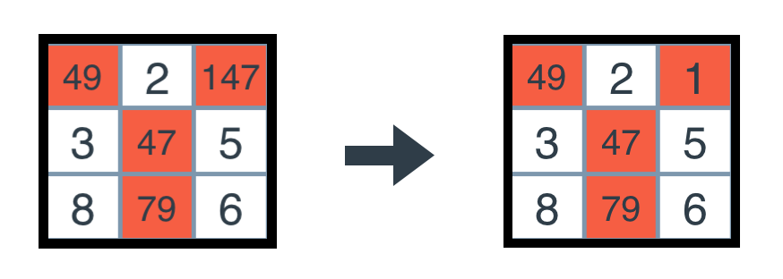
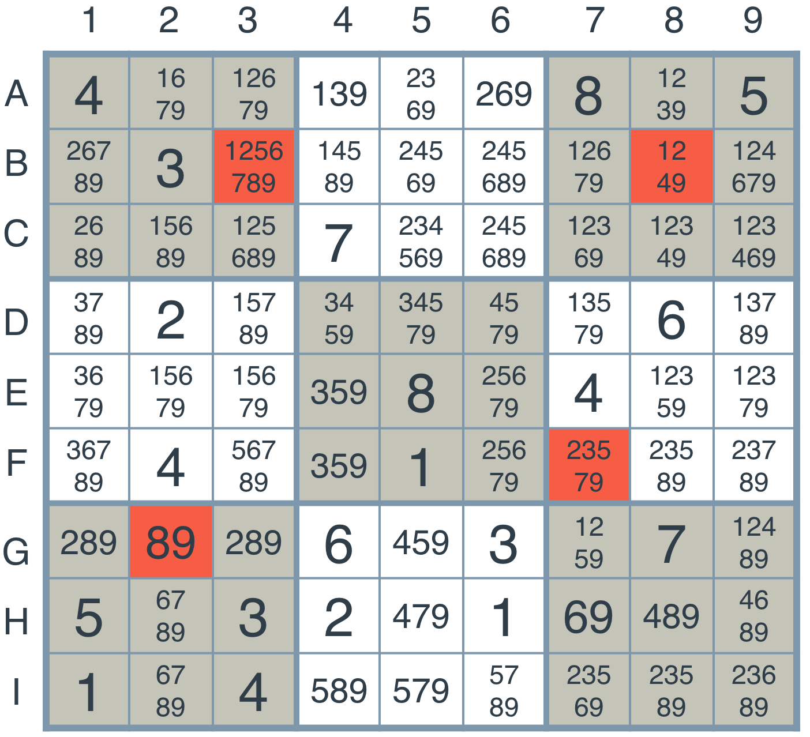

## Diagonal Sudoku Solver

This project solves Sudoku including diagonal uniqueness conditions, i.e. each number appears on each diagonal exactly once. The project employs **naked twins** optimization as well.

## Strategies used:

# 1. Elimination
*First, we can look around each box and see which values can't be there*

On the following picture we focus on the red box. Here we can see explore all units the red box is in and see which values it can't have. From column units, we see that it can't have values **2** and **1**. From row unit it can't take values **9**, **3**, **5** and **1**. From square values it can't have **2**, **3**, **5**, **8** and **6**. So the only values left are **4** and **7**, so this box becomes [**47**](https://en.wikipedia.org/wiki/Agent_47). 

# 2. Only choice
*Second, we can take a deeper look at some special occurences*

If we know that in a unit there is only one choice for a particular box, like when we look at the square in the picture and see that **1** appears only once in a box with **147**, we can simply set the value of this box to **1**:

# 3. Depth-First Search
*Third, we can search for unknown values by searching through a tree of possible solutions*

Here we can try to enforce a single value in a box with minimal number of digits and apply all aforementioned strategies to newly gained state. Then we either come to a solution, end up in an invalid state or need to subsequently enforce a single value in another box. We can do this recursively until we find a proper solution.
  
On the following picture we select node with value **89**, first branch with **8** fixed in this place and if subsequent search is not successful, we fix **9** there instead:

# 4. Naked Twins
*Fourth, we are interested to know how constraint propagation is used to solve the naked twins problem.*  
For each newly stable grid state we cycle through each box and then one by one investigate all its peers of different types, one type at a time (column, row, square). If we find a matching naked twin in the investigated peer group, we remove two shared digits from each box in the peer group other than naked twin boxes. Obviously, this could be further extended to n-tuples as the same algorithm can work on triples, quadruples etc.

On the following picture there are two boxes with **23** in the same column unit. Therefore in this unit we eliminate all occurrences of **2** and **3** as the second picture shows:

# 5. Diagonal Sudoku
*Fifth, we can ask how do we use constraint propagation to solve the diagonal sudoku problem?*  
Diagonals can be enforced as another two units and just added them to the mix of column, row and square units. Then the code stays the same and diagonals will be properly handled.  

# 6. How to run it?
You need **Python 3** and optionally *PyGame*. Then simply run

    python solution.py
    
and enjoy the solution!
